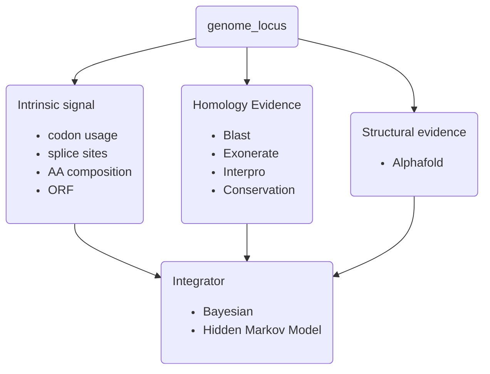

# hqprotein &mdash; improved protein gene models

<!-- TOC -->
* [hqprotein &mdash; improved protein gene models](#hqprotein--improved-protein-gene-models)
  * [Contributing to the project](#contributing-to-the-project)
    * [Suggestions for working together](#suggestions-for-working-together)
  * [Background](#background)
    * [Similar efforts that integrate exon prediction and protein comparison](#similar-efforts-that-integrate-exon-prediction-and-protein-comparison)
  * [Possible information to include](#possible-information-to-include)
  * [Approach](#approach)
  * [References](#references)
      * [General](#general)
      * [Alphafold](#alphafold)
<!-- TOC -->

## Contributing to the project
To push to the project you must be collaborator. Send a request to Gribskov (mgribsko@purdue.edu) 
to be added.
This is preferred because then we can properly credit any contributions. Alternatively, you could
fork the repo and send a pull request.

### Suggestions for working together
* To avoid confusion it's preferable to work on your own branch so that we don't interfere with 
each other
* Please do not store large datafiles. We need to figure out a convenient way to share such files, 
* any suggestions?

## Background

Anecdotally it seems that may gene models in complete genomes contain errors 
such as missing exons, included introns, artificial fusion to adjacent genes,
and artificial splitting into multiple predicted genes. Thee is a great deal of 
information that is not included in standard gene models that might be able to 
detect and correct these errors.

Some of the most fundamental work in this are was done by Roger Staden.
> Staden R. Measurements of the effects that coding for a protein has on a DNA sequence and their use for finding genes. Nucleic Acids Res. 1984 Jan 11;12(1 Pt 2):551-67. doi: 10.1093/nar/12.1part2.551. 
> 
> Staden R. Finding protein coding regions in genomic sequences. Methods Enzymol. 1990;183:163-80. doi: 10.1016/0076-6879(90)83012-x.

### Similar efforts that integrate exon prediction and protein comparison
* helixer
  * https://github.com/usadellab/Helixer
  > Felix Holst, Anthony M. Bolger, Felicitas Kindel, Christopher Günther, Janina Maß, Sebastian Triesch, Niklas Kiel, Nima Saadat, Oliver Ebenhöh, Björn Usadel, Rainer Schwacke, Andreas P. M. Weber, Marie E. Bolger, Alisandra K. Denton. "Helixer: ab initio prediction of primary eukaryotic gene models combining deep learning and a hidden Markov model." Nat Methods (2025).
DOI: https://doi.org/10.1038/s41592-025-02939-1
  >
  > Felix Stiehler, Marvin Steinborn, Stephan Scholz, Daniela Dey, Andreas P M Weber, Alisandra K Denton. "Helixer: Cross-species gene annotation of large eukaryotic genomes using deep learning." Bioinformatics, btaa1044 (2020).
DOI: https://doi.org/10.1093/bioinformatics/btaa1044
* spaln
  * https://github.com/ogotoh/spaln
  > Iwata, H. and Gotoh, O. Benchmarking spliced alignment programs including Spaln2, an extended version of Spaln that incorporates additional species-specific features. Nucleic Acids Research 40 (20) e161 (2012)
  >
  > Gotoh, O. Homology-based gene structure prediction: simplified matching algorithm using a translated codon (tron) and improved accuracy by allowing for long gaps. Bioinformatics 16 (3) 190-202 (2000)
  >
  > Gotoh, O. Cooperation of Spaln and Prrn5 for construction of gene-structure-aware multiple sequence alignment. In: Katoh K. (eds) Multiple Sequence Alignment. Methods in Molecular Biology 2231, Humana, New York, NY. (2021).
  >
  > Gotoh, O. Spaln3: improvement in speed and accuracy of genome mapping and spliced alignment of protein query sequences Bioinformatics 40 (8) btae517 (2024).
* GenomeThreader &mdash; last update around 2020
  * https://genomethreader.org/
  * paper: https://genomethreader.org/doc/GreBreSpaKur2005.pdf
* MetaEuk
  * https://github.com/soedinglab/metaeuk
    > Levy Karin E, Mirdita M and Soeding J. MetaEuk – sensitive, high-throughput gene discovery and annotation for large-scale eukaryotic metagenomics. Microbiome. 2020; 8:48
## Possible information to include
For simplicity, we can discuss coding reading frames, **cORFs**, noncoding reading
frames that overlap a cORF, **oORFs**, noncoding reading frames such as introns
or UTRs, **nORFs**, and intergenic reading frames, **iORFs**.
* Amino acid composition - cORFs have a typical composition which is very 
different from the composition of oORFs, nORFs, or iORFs. 
or noncoding regions(introns, intergenic)
* codon preference - cORFs have a preference for specific
codons within a synonymous family, again this is different from 
oORFs, nORFs, or iORFs.
* codon usage - the frequency of each codon, combines amino acid 
composition and codon preference.
* DNA kmer composition - usually kmer composition is the basis for intron/exon 
prediction based on a hexamer (fifth order) hidden markov model. As this is
included in the base prediction, it may be superfluous. Would not distinguish 
cORFs, oORFs, nORFs, and iORFs.
* Protein kmer - Dipeptide composition should be different for cORFS and
oORFs, nORFs, or iORFs. Hexamer based models should already include dipeptide
frequencies and codon preference.
* 3-base periodicity. Fickett showed that coding regions have a distinct
three base periodicity due to the stronger  constraints on the first and
second bases of the codon. This allows coding regions (cORF and oORF) 
to be distinguished from noncoding regions (nORF and iORF).
  > Fickett JW. Recognition of protein coding regions in DNA sequences. Nucleic Acids Res. 1982 Sep 11;10(17):5303-18. doi: 10.1093/nar/10.17.5303.
* Splice donor/acceptor sites - use to identify possibly spliced regions
with ORFs. The canonical GT|AG found at the beginning|end of introns should
work, but what abut noncanonical splice sites?  GC|AG and AT|AC make 
up 0.89% and 0.10% of splices sites in human, respectively (species specific). 
  > Parada GE, Munita R, Cerda CA, Gysling K. A comprehensive survey of non-canonical splice sites in the human transcriptome. Nucleic Acids Res. 2014;42(16):10564-78. doi: 10.1093/nar/gku744.
* For detecting fusions and splitting, interpro motifs can be used. Tabulate which motifs are likely to be
found together or not.
## Approach
1. My hand-wavy idea is to calculate a posterior probability of coding on a 
base-by-base or codon-by-codon basis to identify ORFs or parts of ORFs that are
most likely to be coding.
Another possibility would be to train an ML model.
2. Could use a hidden markov model where the match probabilities are drawn from aligned homologous sequence.
Positions could be weighted by the fraction of related sequence that match to the bases. This information
can be combined with coding probability based on codon usage, and probability of switching reading frame
based on splice donor/acceptor sequence. Calculating the background probabilities are hard, I guess either
random real sequences or randomized sequences preserving 2mer or 3mer frequencies.

## References
#### General
> Fickett JW. Recognition of protein coding regions in DNA sequences. Nucleic Acids Res. 1982 Sep 11;10(17):5303-18. doi: 10.1093/nar/10.17.5303.
> 
> Parada GE, Munita R, Cerda CA, Gysling K. A comprehensive survey of non-canonical splice sites in the human transcriptome. Nucleic Acids Res. 2014;42(16):10564-78. doi: 10.1093/nar/gku744.
>
> Staden R. Measurements of the effects that coding for a protein has on a DNA sequence and their use for finding genes. Nucleic Acids Res. 1984 Jan 11;12(1 Pt 2):551-67. doi: 10.1093/nar/12.1part2.551. 
> 
> Staden R. Finding protein coding regions in genomic sequences. Methods Enzymol. 1990;183:163-80. doi: 10.1016/0076-6879(90)83012-x.
> 

#### Alphafold
> Liu H, Laiho A, Törönen P, Holm L. 3-D substructure search by transitive closure in AlphaFold database. Protein Sci. 2025 Jun;34(6):e70169. doi: 10.1002/pro.70169. 
> 
>Helen Rebecca Davison, Ulrike Böhme, Shahram Mesdaghi, Paul A. Wilkinson, David S. Roos, 
> Andrew R. Jones, Daniel J. Rigden. The promise of AlphaFold for gene structure annotation
bioRxiv 2025.10.21.683479; doi: https://doi.org/10.1101/2025.10.21.683479