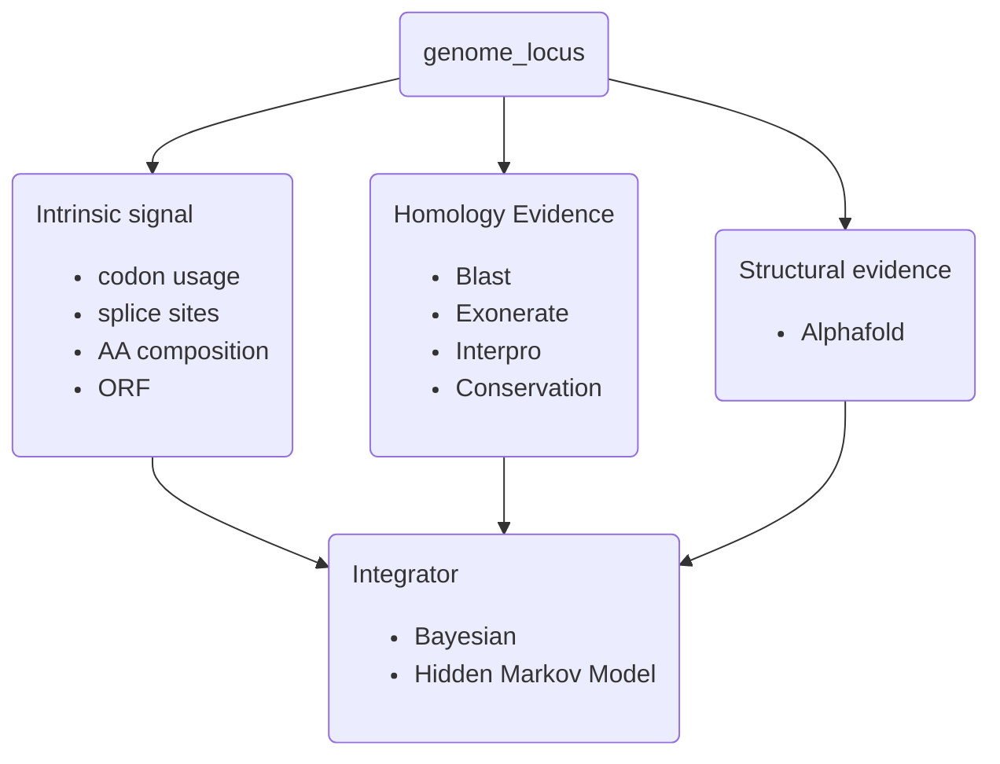

```mermaid
graph TB


genome(genome_locus)
homology(Homology Evidence<ul><li>Blast</li><li>Exonerate</li><li>Interpro</li><li>Conservation</li></ul>)
intrinsic(Intrinsic signal<ul><li>codon usage</li><li>splice sites</li><li>AA composition</li><li>ORF</li></ul>)
structural(Structural evidence<ul><li>Alphafold</li></ul>)
integrate(Integrator<ul><li>Bayesian</li><li>Hidden Markov Model</li>)
genome-->intrinsic-->integrate
genome-->homology-->integrate
genome-->structural-->integrate

classDef left text-align:left;
class genome,intrinsic,homology,structural,integrate left;


```
Genomic locus --> Intrinsic signal
